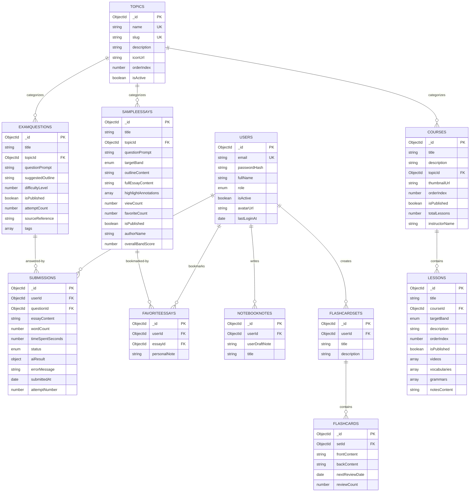

# Database Entity Relationship Diagram

## Visual Representation



## Collection Dependencies (Hierarchy)

```
Level 1 (Independent):
├── users
└── topics

Level 2 (Depends on Level 1):
├── courses (→ topics)
├── sampleessays (→ topics)
├── examquestions (→ topics)
├── notebooknotes (→ users)
└── flashcardsets (→ users)

Level 3 (Depends on Level 2):
├── lessons (→ courses)
├── favoriteessays (→ users, sampleessays)
├── flashcards (→ flashcardsets)
└── submissions (→ users, examquestions)
```

## Data Flow Examples

### Student Learning Flow
```
1. Browse Topics
   ↓
2. Select Course (filtered by Topic)
   ↓
3. Study Lessons (videos, vocabulary, grammar)
   ↓
4. Read Sample Essays (with highlights)
   ↓
5. Bookmark Favorites
   ↓
6. Create Flashcards from learned content
   ↓
7. Practice with Exam Questions
   ↓
8. Submit Essay for AI Grading
   ↓
9. Review AI Feedback (scores + error analysis)
   ↓
10. Iterate and improve
```

### AI Grading Flow
```
ExamQuestion → Student writes → Submission (DRAFT)
                                     ↓
                              Submit (SUBMITTED)
                                     ↓
                              AI Processing (PROCESSING)
                                     ↓
                              AI Analysis:
                              - Task Response Score
                              - Coherence Score
                              - Lexical Score
                              - Grammar Score
                              - Error Detection
                              - Feedback Generation
                                     ↓
                              Save to aiResult (COMPLETED)
                                     ↓
                              Student views detailed feedback
```

## Indexes Summary

**For User Queries:**
- users: email (unique)
- submissions: userId + createdAt (compound)
- favoriteessays: userId
- notebooknotes: userId + createdAt
- flashcardsets: userId

**For Content Discovery:**
- courses: topicId, isPublished + orderIndex
- lessons: courseId + orderIndex, targetBand
- sampleessays: topicId, targetBand, favoriteCount (desc)
- examquestions: topicId, difficultyLevel, tags

**For Relationships:**
- favoriteessays: userId + essayId (unique compound)
- flashcards: setId, nextReviewDate
- submissions: questionId, status

## Important Business Rules

1. **Unique Email**: Each user must have unique email address
2. **Unique Topic**: Topic names and slugs must be unique
3. **One Favorite Per Essay**: User can only favorite same essay once (enforced by unique compound index)
4. **Auto Word Count**: Submission wordCount is auto-calculated on save
5. **Auto Slug**: Topic slug is auto-generated from name
6. **Default Role**: New users default to STUDENT role
7. **Default Status**: New submissions default to DRAFT status
8. **Band Scores**: All scores range from 0-9 (IELTS scale)
9. **Difficulty Levels**: Exam questions rated 1-5
10. **Timestamps**: All documents have createdAt and updatedAt

## Cascading Delete Considerations

When deleting entities, consider these relationships:

- **Delete User** → Should handle: submissions, favoriteessays, notebooknotes, flashcardsets (and cascading flashcards)
- **Delete Topic** → Should update/handle: courses, sampleessays, examquestions
- **Delete Course** → Should handle: lessons
- **Delete SampleEssay** → Should handle: favoriteessays
- **Delete FlashcardSet** → Should handle: flashcards
- **Delete ExamQuestion** → Should handle: submissions

*Note: Current implementation does not include cascade delete logic - requires manual implementation*
